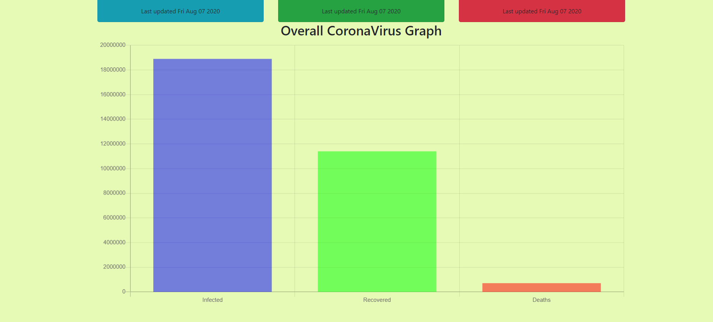
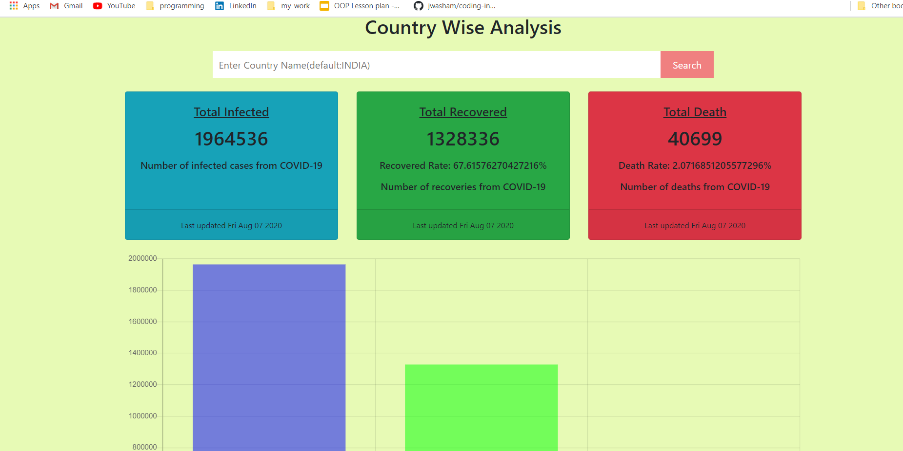
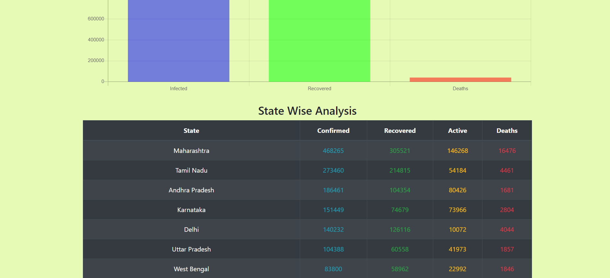

# React App

> Weather App made using OpenWeatherMapAPI, Recipe App made using EdamamAPI and CovidTracker made using https://covid19.mathdro.id/api. 
> In 'App.js' , put in your own APP_KEY which you will receive when you create an account in OpenWeatherMapAPI and EdamamAPI. 
>Link to OpenWeatherMapAPI website : https://openweathermap.org/api 
>Link to EdamamAPI website : https://developer.edamam.com/ 
>Link to CovidAPI website : https://covid19.mathdro.id/api 

# Overview Of The Website

About

 

Weather

 

Recipe

 

Corona Tracker

 
 
 
 
 
 

This project was bootstrapped with [Create React App](https://github.com/facebook/create-react-app).

>Clone the repository. 
>Install react,react-dom and react-router and other dependencies if required if you dont have it previously install. 
>Run npm start in the command line to run the website on local host.

## App Info

### Author [Yash Jhaveri](https://www.linkedin.com/in/yash-jhaveri-3b0882192/)